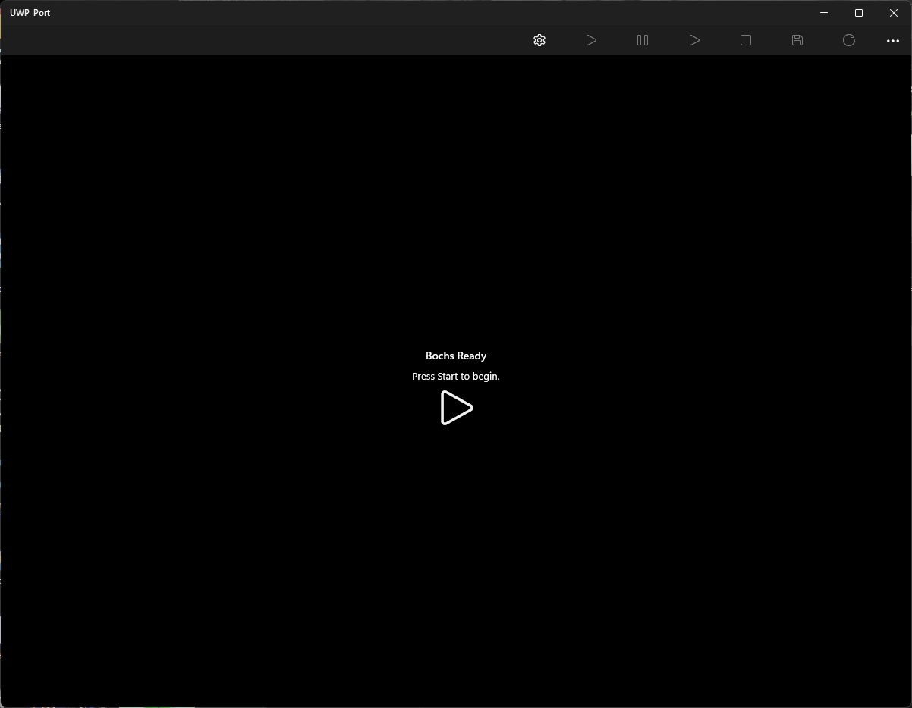

# UWP DirectX Bochs Port

Este documento descreve o estado atual do port UWP/XAML/DirectX do Bochs. O
objetivo do projeto e manter o core nativo do Bochs e concentrar o codigo
especifico de UWP no projeto `UWP-Port`.

## Projetos

- `UWP-Port/UWP-Port.vcxproj`: aplicativo UWP C++/CX, tela XAML, loop de
  renderizacao DirectX, entrada, audio XAudio2/AudioGraph/MIDI, selecao de
  imagens e ciclo de vida da aplicacao.
- `bochs_core_uwp/bochs_core_uwp.vcxproj`: biblioteca estatica que empacota o
  core executavel do Bochs sem expor o `main()` desktop.
- `vs2019/*`: bibliotecas estaticas do Bochs usadas pelo core UWP. Os projetos
  sao referenciados com `UseUwpCoreRuntime=true`, o que define
  `BX_UWP_CORE_LIBRARY=1` e `BX_WITH_UWP_DX=1`.

## Build pelo CMD

Todos os comandos abaixo devem ser executados no `cmd.exe`. Ajuste `REPO` se o
repositorio estiver em outro local.

```cmd
set "REPO=C:\Users\X4O1Z\Documents\GitHub\Bochs-UWP"
set "MSBUILD=C:\Program Files\Microsoft Visual Studio\18\Community\MSBuild\Current\Bin\MSBuild.exe"
cd /d "%REPO%\UWP-Port"
```

Build Debug:

```cmd
"%MSBUILD%" UWP-Port.vcxproj /p:Configuration=Debug /p:Platform=x64 /m /nr:false /v:minimal
```

Build Release:

```cmd
"%MSBUILD%" UWP-Port.vcxproj /p:Configuration=Release /p:Platform=x64 /m /nr:false /v:minimal
```

Build do MSIX bundle:

```cmd
set "APPVER=1.0.0.2"
set "CONFIG=Debug"
"%MSBUILD%" UWP-Port.vcxproj /p:Configuration=%CONFIG% /p:Platform=x64 /p:AppxBundle=Always /p:AppxBundlePlatforms=x64 /m /nr:false /v:minimal
dir /s /b "%REPO%\UWP-Port\AppPackages\UWP-Port\*.msixbundle"
```

Para gerar um bundle Release, altere `CONFIG` para `Release` e execute o mesmo
comando do MSBuild. Antes de reconstruir um pacote instalavel depois de mudar o
codigo, incremente `Identity Version` em `Package.appxmanifest`; o Windows pode
rejeitar um pacote com a mesma identidade e versao, mas conteudo diferente.

Se o bundle gerado estiver sem assinatura, assine com a chave temporaria:

```cmd
set "SIGNTOOL=C:\Program Files (x86)\Windows Kits\10\bin\10.0.26100.0\x64\signtool.exe"
set "PFX=%REPO%\UWP-Port\UWP-Port_TemporaryKey.pfx"
"%SIGNTOOL%" sign /fd SHA256 /f "%PFX%" "%REPO%\UWP-Port\AppPackages\UWP-Port\UWP-Port_%APPVER%_%CONFIG%_Test\UWP-Port_%APPVER%_x64_%CONFIG%.msixbundle"
```

Instale o pacote de teste gerado a partir do `cmd.exe`:

```cmd
cd /d "%REPO%\UWP-Port\AppPackages\UWP-Port\UWP-Port_%APPVER%_%CONFIG%_Test"
powershell.exe -ExecutionPolicy Bypass -File .\Install.ps1 -Force -SkipLoggingTelemetry
```

## Fronteiras

- `gui/uwp_dx.cc` implementa o backend `bx_gui_c` do Bochs.
- `gui/uwp_dx_bridge.h` define a ABI C entre o core Bochs e o host UWP.
- `UWP-Port/BochsUwpBridge.*` guarda framebuffer, eventos de teclado/mouse,
  foco, estado de captura de mouse e pedido de shutdown.
- `UWP-Port/BochsRuntime.*` cria a thread de emulacao, chama
  `bochs_core_uwp_run()`, pausa, retoma, salva estado e solicita desligamento.
- `UWP-Port/UWP_PortMain.*` conecta a pagina XAML ao runtime, renderer, entrada
  e audio.
- `UWP-Port/Content/BochsFrameRenderer.*` envia o framebuffer BGRA do Bochs para
  uma textura dinamica `ID3D11Texture2D` e desenha no `SwapChainPanel`.
- `UWP-Port/BochsUwpStorage.*` seleciona imagens, gera o `bochsrc.generated.txt`
  e administra o diretorio de save-state.
- `UWP-Port/BochsUwpFileBridge.*` expoe arquivos brokered `uwp://...` ao core
  por `IRandomAccessStream`, com open, read, write, seek, flush, resize e
  consulta de tamanho.
- `UWP-Port/BochsUwpAudio.*` implementa saida PCM por XAudio2, entrada PCM por
  AudioGraph e saida MIDI por `MidiSynthesizer`.

## Renderizacao

O backend UWP mantem um framebuffer intermediario BGRA8 no lado CPU. O renderer
UWP apresenta esse framebuffer como `DXGI_FORMAT_B8G8R8A8_UNORM`.

- Modos SVGA que escrevem pixels de 32 bits copiam tiles diretamente para BGRA8.
- Modos graficos indexados mantem um shadow buffer de 8 bits e aplicam a paleta
  do Bochs antes da publicacao.
- Modo texto usa o caminho comum de texto do Bochs; os glifos sao rasterizados em
  CPU e enviados ao mesmo framebuffer BGRA8.
- `graphics_tile_update()` atualiza regioes do framebuffer.
- `graphics_tile_update_in_place()` marca o framebuffer como sujo.
- `flush()` publica o frame no `BochsUwpBridge`.
- `BochsFrameRenderer` mapeia uma textura D3D dinamica, copia o frame e desenha
  um quad em tela cheia.

## Teclado e Mouse

A entrada do UWP passa pela UI thread e e consumida pela thread de emulacao em
`gui/uwp_dx.cc`.

Teclado:

- `CoreWindow::KeyDown` e `KeyUp` sao convertidos para scan codes ou virtual keys
  normalizados.
- O backend mapeia teclas comuns, teclado numerico, modificadores esquerdo e
  direito, Windows/Menu, Print Screen, Pause/Break, F1-F12 e varias teclas
  estendidas de energia/midia/navegacao.
- `bx_gui_c::key_event()` repassa diretamente para `DEV_kbd_gen_scancode()`.
- Ao perder foco, `release_keyboard_state()` limpa modificadores e toggles.

Mouse:

- O port suporta coordenadas absolutas e relativas.
- Quando o guest pede modo absoluto, a posicao no `SwapChainPanel` e escalada
  para a faixa de coordenadas do Bochs.
- Quando o guest usa modo relativo/capturado, `MouseDevice::MouseMoved` fornece
  deltas fisicos e o cursor do sistema e ocultado.
- `Ctrl+Alt+M` alterna explicitamente a captura relativa: solta o mouse quando
  ele esta preso e solicita captura novamente quando o usuario quiser continuar.
- Botoes esquerdo, direito, meio, XButton1 e XButton2 entram no mask de botoes.
- A roda e enviada pelo eixo `z` do evento de ponteiro.
- Os toggles de captura seguem o codigo do Bochs: combinacoes de teclado e
  botoes passam por `mouse_toggle_check()` / `toggle_mouse_enable()`.

## Armazenamento e Bochsrc

O arquivo de configuracao e gerado em
`ApplicationData::Current->LocalFolder\bochsrc.generated.txt`.

O gerador atual inclui:

- `display_library: uwp_dx`
- memoria, CPU, BIOS e VGABIOS. A RAM do guest e limitada ao intervalo da UI
  (16 MB a 8192 MB), e a alocacao residente `host` do Bochs e limitada a
  512 MB com blocos de 1 MB, deixando o gerenciador de overflow
  `BX_LARGE_RAMFILE` do Bochs cuidar de guests maiores sem obrigar o processo
  UWP a reservar toda a RAM do guest.
- `clock: sync=both, time0=local, rtc_sync=1` para que os timers nativos de
  realtime e slowdown do Bochs mantenham os segundos do guest alinhados ao host
- `pci: enabled=1, chipset=i440fx`
- `plugin_ctrl` para audio, rede e dispositivos opcionais
- `sound`, `speaker`, `sb16`, `es1370`
- `ne2k` via slirp quando rede esta ligada
- `floppya` quando uma imagem de floppy e selecionada
- `ata0` e `ata0-master` para HDD, com `mode=` inferido ou selecionado na UI
- `ata0-slave` para ISO/CD-ROM
- `ata1` e `ata1-master` para uma pasta viva opcional do host montada como
  VVFAT somente leitura
- `boot` com ate tres dispositivos ordenados
- `log: -`

Camada de arquivos UWP:

- Arquivos escolhidos pelo usuario podem ser registrados no
  `StorageApplicationPermissions::FutureAccessList` e representados no
  `bochsrc` como `uwp://token/nome`.
- `BochsUwpFileBridge` resolve `uwp://...`, abre o `StorageFile` como
  `IRandomAccessStream` e fornece ao core operacoes sincronas de open, close,
  seek, read, write, flush, set-size e get-size.
- O bridge respeita abertura somente leitura ou leitura/escrita. Se um floppy
  nao puder ser aberto para escrita, o controlador tenta reabrir somente leitura
  e marca a midia como protegida contra escrita.
- O backend `uwp_image_t` usa essa camada para HDD raw em modo `uwp`.
- O controlador de floppy tambem usa essa camada para imagens raw brokered.
- O parser de `floppya: image="uwp://..."` tambem usa a camada UWP para consultar
  o tamanho real da imagem e detectar a geometria correta antes do boot.
- O backend Win32 de CD-ROM usado no build UWP usa a mesma camada para ISO/CDR
  brokered.

Arquivos e modos de imagem:

- BIOS e VGABIOS padrao sao empacotados em `Assets`.
- HDD bruto (`.img`, `.ima`, `.flp`, `.dsk`, `.fd`, `.vfd`, `.bin`, `.raw`) usa
  `FutureAccessList` e URI `uwp://...` quando possivel, abrindo por
  `IRandomAccessStream` no core em modo `uwp`.
- O seletor de HDD aceita `.img`, `.raw`, `.bin`, `.dsk`, `.hdd`, `.vhd`,
  `.vpc`, `.vmdk` e `.vdi`.
- O modo de imagem pode ficar em `auto` ou ser escolhido manualmente na UI:
  `flat`, `vpc`, `vbox`, `vmware4`, `vmware3`, `sparse`, `growing`,
  `undoable` ou `volatile`.
- A inferencia automatica usa `vmware4` para `.vmdk`, `vbox` para `.vdi`,
  `vpc` para `.vhd`/`.vpc`, `uwp` para `uwp://...` e `flat` para raw comuns.
- ISO/CD-ROM aceita `.iso`, `.cdr` e `.toast` e agora usa `uwp://...` direto
  quando o arquivo escolhido pode ser registrado no `FutureAccessList`.
- Floppy aceita `.img`, `.ima`, `.flp`, `.dsk`, `.fd`, `.vfd`, `.bin` e
  `.raw`, tambem com caminho `uwp://...` direto para imagens raw brokered.
- Para floppy brokered, o core reconhece tamanhos padrao como 160K, 180K, 320K,
  360K, 720K, 1.2M, 1.44M, 1.68/1.72/1.8M e 2.88M. Tamanhos fora desses
  padroes continuam sendo rejeitados como imagem de floppy desconhecida.
- Se o registro brokered falhar, o picker ainda cai para copia em `LocalFolder`
  para manter compatibilidade.

Pasta compartilhada viva:

- A aba Boot pode montar uma pasta do host como disco VVFAT vivo somente
  leitura.
- A entrada gerada usa `path="readonly:<pasta-do-host>"`, `mode=vvfat` e um
  `journal=` dentro de `ApplicationData::Current->LocalFolder`, evitando que o
  Bochs crie arquivos temporarios do VVFAT dentro da pasta do host.
- O backend VVFAT reconhece o prefixo `readonly:`, marca a imagem como
  `HDIMAGE_READONLY` e rejeita escritas do guest antes que elas cheguem ao
  diretorio do host.
- A selecao da pasta registra o item no `FutureAccessList` e tambem verifica se
  o core Bochs consegue enumerar o caminho real usando APIs Win32 antes de
  aceitar a configuracao.
- Como isso usa um caminho real do host, e nao um snapshot, o Windows pode
  exigir que o acesso ao sistema de arquivos esteja habilitado para o app nas
  configuracoes de privacidade. O manifesto declara a capability restrita
  `broadFileSystemAccess` para esse acesso por caminho.

## Boot

O Bochs aceita uma sequencia `boot:` com ate tres entradas, sem repeticao. O
primeiro dispositivo precisa ser inicializavel pelo BIOS (`floppy`, `disk` ou
`cdrom`). O UWP agora expoe tres seletores:

- `HDD` -> `disk`
- `ISO` -> `cdrom`
- `Floppy` -> `floppy`
- `Nenhum` para segunda/terceira posicao

O gerador tambem normaliza aliases internos como `hd`, `hdd`, `iso`, `cd`, `a`
e `c`, remove duplicatas e ignora dispositivos sem midia selecionada. Se nada
for selecionado, o fallback e `boot: disk`.

Quando existe ISO/CD-ROM mas nao existe HDD, o gerador monta a unidade optica em
`ata0-master`. Quando HDD e ISO estao presentes juntos, o HDD fica em
`ata0-master` e a ISO em `ata0-slave`.

## PCI e i440FX

O core UWP compila e usa a pilha PCI nativa do Bochs:

- `iodev/pci.cc`: host bridge i430FX/i440FX/i440BX.
- `iodev/pci2isa.cc`: PIIX/PIIX3/PIIX4 PCI-to-ISA bridge.
- `iodev/pci_ide.cc`: controlador PCI IDE PIIX.

O `bochsrc` gerado seleciona explicitamente:

```text
pci: enabled=1, chipset=i440fx
```

Quando rede ou audio PCI estao ativos, o gerador tambem reserva slots:

- `slotN=ne2k` para a placa NE2K PCI/slirp.
- `slotN=es1370` para audio ES1370 PCI.

O PIIX3/PCI IDE e carregado pelo proprio fluxo de inicializacao do Bochs quando
PCI e ATA estao habilitados.

## Audio, Entrada e MIDI

O audio foi reintegrado usando o stack de som do Bochs:

- `BX_SUPPORT_SOUNDLOW`, `BX_SUPPORT_SB16` e `BX_SUPPORT_ES1370` ficam ativos no
  core UWP.
- `iodev/sound/sounduwp.cc` registra o driver lowlevel `uwp`.
- `sounduwp` implementa objetos reais para `waveout`, `wavein` e `midiout`.
- `UWP-Port/BochsUwpAudio.cpp` abre XAudio2, cria mastering/source voice e
  submete buffers PCM de saida.
- A entrada PCM usa `AudioGraph`, `AudioDeviceInputNode` e
  `AudioFrameOutputNode` para capturar do microfone e alimentar SB16/ES1370.
- A saida MIDI usa `Windows::Devices::Midi::MidiSynthesizer` e traduz comandos
  MIDI do Bochs para mensagens UWP, incluindo eventos de canal, SysEx e mensagens
  de sistema comuns.
- O manifesto declara `DeviceCapability` para `microphone` e `midi`.
- O bochsrc gerado usa:

```text
sound: waveoutdrv=uwp, waveindrv=uwp, midioutdrv=uwp
speaker: enabled=1, mode=sound, volume=15
sb16: enabled=1, wavemode=1, midimode=1
es1370: enabled=1, wavemode=1, midimode=1
```

Wave output toca por XAudio2. Wave input e MIDI usam as implementacoes lowlevel
do driver UWP nativo. Se o dispositivo ou permissao de microfone/MIDI nao
estiver disponivel, o backend falha de forma segura: a captura retorna silencio
e a emulacao continua.

## Rede

O toggle de rede gera `plugin_ctrl: ne2k=1` e:

```text
ne2k: ioaddr=0x300, irq=10, mac=52:54:00:12:34:56, ethmod=slirp, script=""
```

O app linka `ws2_32.lib`, e o core UWP usa os projetos de rede existentes com o
modo slirp ja integrado ao build.

## Ciclo de Vida, Save State e Diagnostico

O ciclo de vida UWP passa por `BochsRuntime`:

- Start cria a thread do core e inicia o render loop.
- Pause chama `bochs_core_uwp_pause()` e aguarda o core entrar em pausa.
- Resume chama `bochs_core_uwp_resume()`.
- Save state pausa a emulacao e salva no slot selecionado.
- O app expoe tres slots de save-state. O slot 1 preserva o caminho historico
  `ApplicationData::Current->LocalFolder\BochsSaveState`; os slots 2 e 3 usam
  `BochsSaveState2` e `BochsSaveState3`.
- Ao salvar em slot ocupado, a UI pede confirmacao de sobrescrita.
- Ao restaurar com emulacao ativa, a UI pede confirmacao antes de desligar a
  sessao atual.
- Restore inicia o core com o caminho de restore (`-r` no boundary nativo).
- Shutdown solicita parada ao core, ao bridge e ao audio.
- Suspend/resize/DPI/orientacao tratam recursos D3D e estado do render loop.

A tela verifica `config` dentro do slot selecionado e habilita restauracao quando
um estado salvo existe. O painel de problemas tambem mostra contador de eventos,
log da sessao, resumo de diagnostico, midias selecionadas, modo efetivo do HDD,
boot order, save-state atual, som e rede.

## Limitacoes Atuais

- O caminho `uwp://...` cobre HDD raw, floppy raw e ISO/CDR/TOAST por
  `IRandomAccessStream`. Formatos que dependem de multiplos arquivos auxiliares,
  como alguns layouts VMDK, ainda podem exigir copia para `LocalFolder` ou que
  os arquivos relacionados estejam acessiveis juntos pelo formato original.
- Pastas VVFAT vivas dependem da permissao de sistema de arquivos do Windows
  para o app. Se a configuracao de privacidade bloquear o caminho real, a
  selecao falha antes do boot em vez de deixar o core Bochs cair durante a
  inicializacao.
- O disco VVFAT compartilhado e propositalmente somente leitura. Escritas do
  guest sao rejeitadas pelo backend de imagem, e a pasta original do host nao e
  modificada.
- Floppy via `uwp://...` depende do tamanho da imagem para detectar o tipo. Uma
  imagem com tamanho nao padronizado nao sera montada como floppy bootavel.
- Imagens VHD/VDI/VMDK continuam usando os backends de imagem correspondentes do
  Bochs quando sao copiadas/localizadas em caminho de arquivo tradicional; o
  modo brokered `uwp` e voltado a imagens raw.
- O fallback para `LocalFolder` ainda e usado quando o `FutureAccessList` nao
  aceita o arquivo ou quando o backend de formato exige acesso por caminho
  normal.
- Entrada de audio depende da permissao de microfone do Windows e do dispositivo
  de captura padrao. Se o Windows negar permissao, o guest recebe silencio.
- MIDI depende do sintetizador MIDI UWP disponivel no sistema.
- A UI ainda e C++/CX/XAML no estilo template DirectX; as fronteiras nativas
  (`BochsUwpBridge`, renderer e runtime) permitem migracao futura para
  C++/WinRT sem mudar o backend `uwp_dx`.
